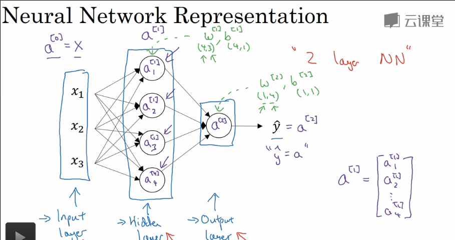
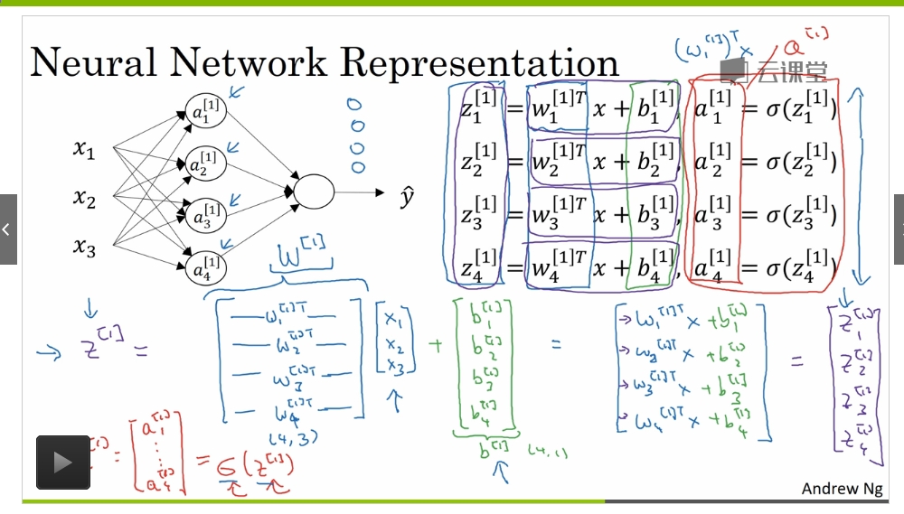
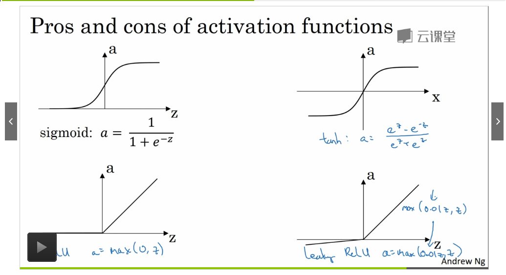
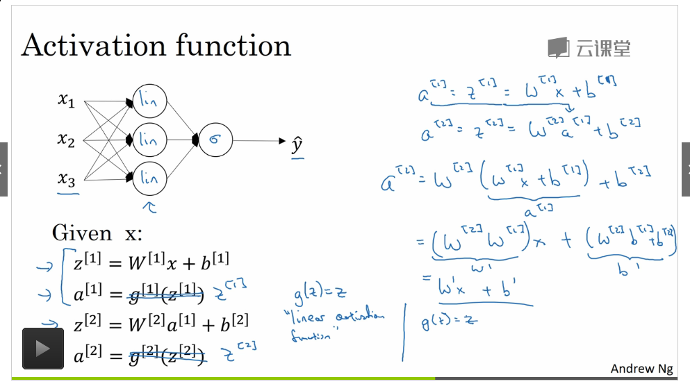
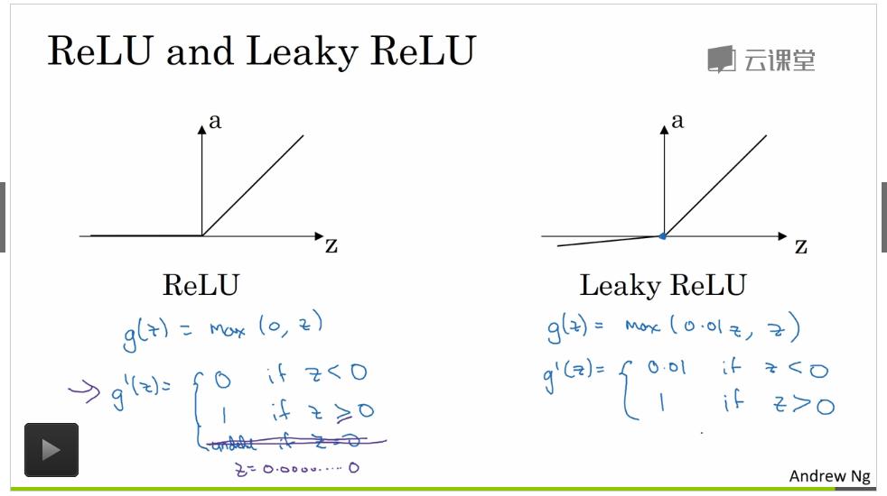
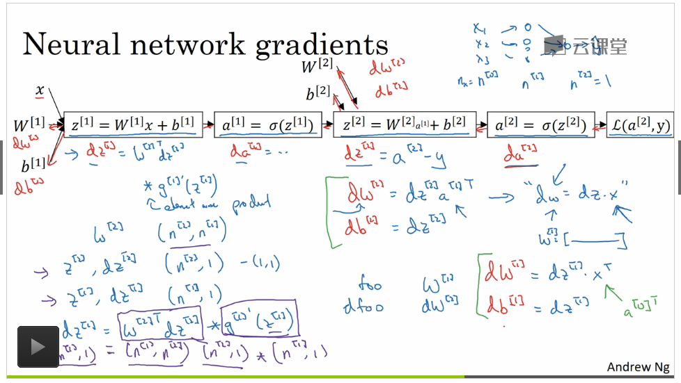
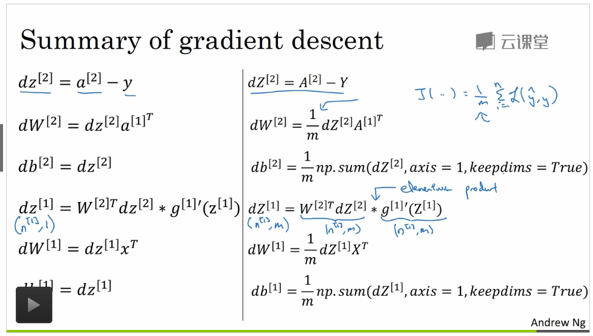

## 浅层神经网络

---

1. 约定符号标记

   1. $$X$$ : 输入，第0层神经网络输入层,也就是 $$a^{[0]}$$
   2. $$W^{[1]}_1$$ : 第一层神经网络(隐藏层)的第一个节点的的 Logistic 模型的参数 $$W$$
   3. $$b_1^{[1]}$$ : 第一层神经网络的第一个节点的 Logistic 模型的参数 $$b$$
   4. $$W^{[1]}$$ : **第一层神经网络的隐藏层参数 $$W$$, 是一个 $$(n_{hidden},n_{input})$$ 大小的矩阵**
   5. $$Z^{[1]}$$ : 第一层神经网络的隐藏层整合函数计算结果，列向量
   6. $$a^{[1]}$$ : 第一层神经网络隐藏层激活计算结果，列向量
   7. $$a^{[1](1)}$$ : 第一层神经网络的隐藏层激活结果的**第一个样本**计算结果
   8. **$$dz/da/dW/db$$ :代表的都是 $$\frac{\partial Loss}{\partial z},\frac{\partial Loss}{\partial a},\frac{\partial Loss}{\partial W},\frac{\partial Loss}{\partial b}$$ 的缩写**

   

   

2. 注意点

   1. 计算神经网络的层次数目的时候，不计算输入层，或者说输入层是第 $$0$$ 层
   2. 神经网络可以看作是对 Logistic 模型的多次计算和堆叠形成的模型

3. 神经网络的前向计算

   1. 单样本的前向计算

      **$$X$$ 是一个列向量**
      $$
      Z^{[1]}=W^{[1]} X+b^{[1]}=W^{[1]} a^{[0]}+b^{[1]}\\
      a^{[1]}=\theta(Z^{[1]})\\
      Z^{[2]}=W^{[2]}a^{[1]}+b^{[2]}\\
      y'=a^{[2]}=\theta(Z^{[2]})
      $$

   2. 多样本的前向计算(批量)

      **$$X$$ 是一个矩阵(n,m),n是特征的数目,m是计算的批次中的样本的数目**　

      $$Z,a$$ 向量的规模也变成了 $$(n_{hidden},m)$$
      $$
      Z^{[1]}=W^{[1]} X+b^{[1]}=W^{[1]} a^{[0]}+b^{[1]}\\
      a^{[1]}=\theta(Z^{[1]})\\
      Z^{[2]}=W^{[2]}a^{[1]}+b^{[2]}\\
      y'=a^{[2]}=\theta(Z^{[2]})
      $$

4. 激活函数的选择

   1. sigmoid

      $$y=\frac{1}{1+e^{-z}}$$

   2. tanh : 效果几乎总是比 sigmoid 函数要好

      1. 数据的均值是 0 ,实现数据的中心化
      2. 隐藏层可以几乎不用 sigmoid，但是如果输出的元素的要求在 $$\{0,1\}$$(比如二元分类的输出) ，需要使用 sigmoid 函数
      3. $$y=\frac{e^z-e^{-z}}{e^z+e^{-z}}$$

   3. ReLU

      1. sigmoid 和 tanh的缺点 : 当输出值非常大的时候我们的导数值非常小，会拖慢梯度下降算法的速度,使用ReLU的导数值会变得的很大，梯度下降速度会比较快

      2. 带泄露的ReLU

         在 $$Z$$ 是负数的时候，导数不是0而是一个平缓的线性值，克服导数为0的缺点

   **经验法则**

   1. 输出的区间在 $$\{0,1\}$$ 需要使用 sigmoid 函数
   2. 其他默认采用ReLU激活函数

   

5. 激活函数在神经网络的必要性

   1. 神经网络训练必须需要 **非线性激活函数**
   2. 如果使用线性的激活函数的话(例子中使用恒等线性激活函数)我们只不过是在计算输入值的线性组合，还不如去掉隐藏层，深度网络没有办法拟合函数，一直在做线性组合操作
   3. 两个线性函数的组合还是线性函数，所以 **线性的隐藏层一点用处也没有**
   4. 

6. 激活函数的导数

   1. sigmoid 
      $$
      g(z)=\frac{1}{1+e^{-z}}\\
      g'(z) = \frac{\partial{g(z)}}{\partial{z}} = g(z)(1-g(z))
      $$

   2. tanh
      $$
      g(z)=\frac{e^z-e^{-z}}{e^z+e^{-z}}\\
      g'(z)=1-(tanh(z))^2
      $$

   3. ReLU

      

7. 反向传播和梯度下降

   

   1. 单样本的形式
      $$
      dz^{[2]}=a^{[2]}-y\\
      dW^{[2]}=dz^{[2]}a^{[1]T}\\
      db=dz^{[2]}\\
      ... \\
      dz^{[1]}=W^{[2]T}dz^{[2]} \times g'(z^{[1]})\\
      dW^{[1]}=dz^{[1]}x^T\\
      db^{[1]}=dz^{[1]}
      $$

   2. 多样本形式

      

8. 参数权重初始化

   1. **绝对不可以将权重全部初始化成0,网络会无效**

   2. 如果 $$W$$ 参数初始化成0，会导致所有的隐含层节点进行同样的计算，称为完全对称，隐含层实际上只有一个节点有用处，对称性在迭代过程中始终存在

      这样导致的结果就是，所有的隐含层节点拟合的函数都是一样的，函数的和不可能拟合出别的函数，神经网络拟合函数的能力消失

   3. 随机初始化参数

   4. $$b$$ 参数随意，可以是0也可以不是，只要 $$W$$ 参数是随机的，不同的隐含层节点计算的就不是一样的函数

   5. **权重矩阵一般都初始化成很小的矩阵，因为如果激活函数是 sigmoid or tanh 的话，过大的计算值容易导致梯度下降速度很慢，但是如果使用 ReLU等其他的激活函数的话，可以不用考虑那么多**

   ​
