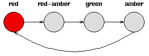
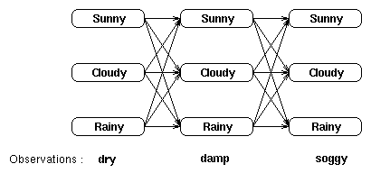
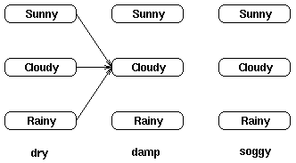

## HMM 简介

---

我们将会看到这样一个系统，我们希望预测的状态并不是观察到的——其底层系统是隐藏的(所以是隐模型)

## HMM 生成模式

---

1. 确定性模式

   每一个状态都是唯一的依赖于之前的某一个状态，系统是确定性的

2. 非确定性模式

   1. 假设模型的当前状态仅仅依赖于前面的几个状态，这成为马尔科夫假设，简化了建模问题，但是这是一种粗糙的假设可能会损失重要的信息

      **比如，今天的天气仅仅通过了解前几天或者昨天的天气情况进行预测，这是不合理的，因为没有综合的考虑锋利，气压等等因素**

   2. 扩展马尔科夫假设

      * 一个马尔科夫过程是状态间的转移仅依赖于前n个状态的过程。这个过程被称之为n阶马尔科夫模型，其中n是影响下一个状态选择的（前）n个状态
      * 最简单的马尔科夫假设是一阶模型
      * 下一个状态的选取是概率性的，而不是确定性的

   3. 对于一个 $$M$$ 个状态的一阶马尔科夫模型，总共有 $$M^2$$ 个状态转移，每一个状态转义都存在一个概率值，称为 **状态转移概率** ，所以 $$M^2$$  可以用一个状态转移矩阵描述

   4. **状态转移矩阵的概率值是确定的**,不是改变的

   5. 天气问题的状态转义矩阵

      

      * 还需要确定一个起始日天气的概率向量，比如第一天确定是晴天的话，向量是

        $$[1.0, 0.0, 0.0]$$

   6. 一阶马尔科夫过程的描述

      任何一个可以用这种方式描述的系统都是一个马尔科夫过程

      * 状态

      * 初始向量

      * 状态转移矩阵 : 

        重要的一点是状态转移矩阵并不随时间的改变而改变——这个矩阵在整个系统的生命周期中是固定不变的

## HMM 隐藏模式

---

1. 一个问题中存在两种状态

   * 观察状态
   * 隐藏状态

   隐藏状态和观察状态之间存在概率关系，**隐藏状态和观察状态之间的数目可以是不同的**

2. 可以使用算法利用 **观察状态** 预测 **隐藏状态**

3. 例子

   一个隐士也许不能够直接获取到天气的观察情况，但是他有一些水藻。民间传说告诉我们水藻的状态与天气状态有一定的概率关系——天气和水藻的状态是紧密相关的。在这个例子中我们有两组状态，观察的状态（水藻的状态）和隐藏的状态（天气的状态）。我们希望为隐士设计一种算法，在不能够直接观察天气的情况下，通过水藻和马尔科夫假设来预测天气。

4. 原理

   > 因此一个隐马尔科夫模型是在一个标准的马尔科夫过程中引入一组观察状态，以及其与隐藏状态间的一些概率关系

   观察到的状态序列和隐藏过程之间存在有一定的概率关系，我们使用隐马尔科夫模型进行建模

   这个模型包含了一个底层隐藏的随时间改变的马尔科夫过程，以及一个与隐藏状态某种程度相关

   的可观察到的状态集合

   _海藻的隐马尔科夫模型_

   

   * 隐藏状态是一个简单的一阶马尔科夫模型，之间是全连接

   * 隐藏状态和观察状态之间的连接表示 : 

     **在给定的马尔科夫过程中，一个特定的隐藏状态生成特定的观察状态的概率**,并且每一个观察模型的概率和是 1
     $$
     P(Dry|Sun) + P(Dryish|Sun) + P(Damp|Sun) + P(Soggy|Sun) = 1\\
     P(Dry|Cloud) + P(Dryish|Cloud) + P(Damp|Cloud) + P(Soggy|Cloud) = 1\\
     P(Dry|Rain) + P(Dryish|Rain) + P(Damp|Rain) + P(Soggy|Rain) = 1\\
     $$

   * 混淆矩阵

     包含了给定一个隐藏状态后得到的观察状态的概率

     

5. 隐马尔科夫模型的组成

   * 隐藏状态：一个系统的（真实）状态，可以由一个马尔科夫过程进行描述（例如，天气）。
     * 观察状态：在这个过程中‘可视’的状态（例如，海藻的湿度）。
     * $$\Pi$$ 向量：包含了（隐）模型在时间t=1时一个特殊的隐藏状态的概率（初始概率）。
     * 状态转移矩阵：包含了一个隐藏状态到另一个隐藏状态的概率
     * 混淆矩阵：包含了给定隐马尔科夫模型的某一个特殊的隐藏状态，观察到的某个观察状态的概率。

## HMM 隐马尔科夫模型

---

1. 定义

   一个隐马尔科夫模型是一个三元组 $$(\Pi, A, B)$$

   1. $$\Pi$$ : 初始化概率向量
   2. $$A$$ : 状态转移矩阵，时间无关
   3. $$B$$ : 混淆矩阵，时间无关

   缺憾 : 隐马尔科夫模型的假设中，状态转移矩阵和混淆矩阵是时间无关的，这是和真实世界不匹配的最重要的一点

2. 应用

   一旦一个系统可以作为 HMM 被描述，可以用来解决三个基本问题

   * 评估 : 给定 HMM 求一个观察序列的概率估计(评估 HMM 的性能)

     已经存在一个给定的观察序列，和多个隐马尔科夫模型 (三元组) ,决定哪一个隐马尔科夫模型可以最好的匹配这个观察序列

     >使用前向-后向算法计算给定的隐马尔科夫模型的观察序列的概率，选择最合适的 HMM 模型

     在语音识别中这种类型的问题发生在当一大堆数目的马尔科夫模型被使用，并且每一个模型都对一个特殊的单词进行建模时。一个观察序列从一个发音单词中形成，并且通过寻找对于此观察序列最有可能的隐马尔科夫模型（HMM）识别这个单词

   * 解码 : 搜索最有可能生成一个观察序列的隐藏状态序列

     我们这时候将工作的中心放在了对隐藏序列的观察上，因为这通常是最有价值的信息

     >使用 Viterbi 算法可以确定搜索已知的观察序列下的最有可能的隐藏状态序列

     在 NLP 词性标注任务中，句子中的单词是观察状态，词性是隐藏状态，利用 Viterbi 算法可以搜索最有可能的隐藏状态，就是寻找词性

   * 学习 : 给定观察序列生成一个 HMM

     最难的问题:

     * 给定观察序列和隐藏状态集，估计得到一个最合适的 HMM 模型 (寻找最合适的三元组)

     >使用前向-后向算法生成训练

## HMM 前向算法

`计算观察序列的概率`

---

1. 穷举搜索

   在 HMM 模型的参数已知的情况下，我们想要得到观察序列的概率

   

   * 上述就是一个典型的 HMM 模型，网格的每一列都是一个可能的隐层状态，之间的转移由状态转移矩阵提供的概率值提供，每一列下面的就是我们要计算的观察序列，混淆矩阵提供对观察状态的概率值

   * 穷举的搜索就是对所有的隐层状态都计算对应的生成指定的观察序列的概率，然后求和即可
     $$
     Pr(dry,damp,soggy | HMM) = \\P(dry,damp,soggy | sunny,sunny,sunny) +\\ P(dry,damp,soggy | sunny,sunny ,cloudy) +\\ P(dry,damp,soggy | sunny,sunny ,rainy) +\\ . . . . +\\P(dry,damp,soggy | rainy,rainy ,rainy)
     $$

   * 穷举搜索对大型的模型来说耗费大量的时间 (指数级)

2. 递归简化

   * 局部概率: 到达网格中的某个中间状态时的概率

     

     第二时间步上的多云状态的局部概率的计算路径

   * 定义符号

     * $$t$$ : 第 $$t$$ 时间步
     * $$j$$ : 某一个时间步上的 $$j$$ 状态
     * $$w_t$$ : 第 $$t$$ 时间步上的观察序列结果
     * $$h_j$$ : 某一个时间步上的第 $$j$$ 隐藏状态

   * 计算局部概率
     $$
     \alpha_{t}(j) = P(w_t | h_j) \times P(\ t\ 时刻所有指向\ j\ 状态的路径概率)
     $$
     

     * 对于这些最终局部概率求和等价于对于网格中所有可能的路径概率求和，也就求出了给定隐马尔科夫模型(HMM)后的观察序列概率
     * 特别的，当 $$t=1$$ 的时候没有任何指向当前状态的路径，局部概率这时候依赖于 $$\Pi$$ 概率和观察概率

   ​

